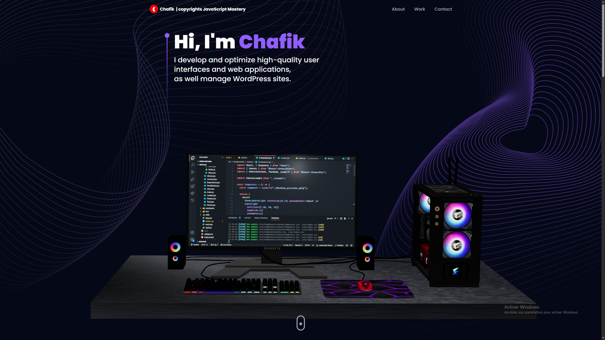

<style>
  .hero-img {
    width: 100%;
    max-height: 200px;
    border-radius: 20px;
    object-fit: cover;
    object-position: top;
  }
</style>
<div align="center">
  <br />
    <a href="https://youtu.be/0fYi8SGA20k?feature=shared" target="_blank">
      
    </a>
  <br />

  <div>
    
    
    
    
    
    
    
    
    
    
  </div>

  <h3 align="center">A 3D Developer Portfolio ( Project Improve 🚀 )</h3>

   <div align="center">
     Credits <a href="https://www.youtube.com/@javascriptmastery/videos" target="_blank"><b>JavaScript Mastery</b></a> YouTube. Join the JSM family!
    </div>
</div>

## 📋 <a name="table">Table of Contents</a>

1. 🤖 [My Improvments](#my-improvments)
1. 🤸 [How to Install](#how-to-install)
## <a name="my-improvments">🤖 My Improvments</a>

The project idea and base code came from JavaScript Mastery. I improved it by fixing console errors and warnings, optimizing components using useCallback, useMemo, and memo, and upgrading libraries to their latest releases. The only exception was Tailwind CSS, which I kept at version 3.4.17, the latest v3 release. Additionally, I replaced the default browser alerts with SweetAlert for a better user experience.


👉 **Console Errors that i fixed**: <br/>
1.

Fixed by upgrading react-tilt to version 1.0.2
```
npm i react-tilt@1.0.2 --force
```
And improtin Tilt like this
```jsx
import { Tilt } from "react-tilt";
```
<br/>
2.

Fixed by replacing 5000 with 5001 so 5001 / 3 = 1667The result must not be a floating-point number, I guess.

```jsx
const [sphere] = useState(() => random.inSphere(new Float32Array(5001), { radius: 1.2 }));
```

👉 **Components that I optimized using React.js optimization solutions**:<br/>
1. Using useCallback and useMemo :
```jsx
  // Contact.jsx
  const handleChange = useCallback((e) => {
    const { target } = e;
    const { name, value } = target;

    setForm((prevForm) => ({
      ...prevForm,
      [name]: value,
    }));
  }, []);

  const handleSubmit = useCallback((e) => {
    e.preventDefault();
    setLoading(true);

    emailjs
      .send(
        process.env.REACT_APP_EMAILJS_SERVICE_ID,
        process.env.REACT_APP_EMAILJS_TEMPLATE_ID,
        {
          from_name: form.name,
          to_name: "Chafik",
          from_email: form.email,
          to_email: "chafik22266@gmail.com",
          message: form.message,
        },
        process.env.REACT_APP_EMAILJS_PUBLIC_KEY
      )
      .then(
        () => {
          setLoading(false);
          //alert("Thank you. I will get back to you as soon as possible.");
          // make amazing alert here
          Swal.fire({
            position: "center",
            icon: "success",
            title: "Thank you. I will get back to you as soon as possible.",
            showConfirmButton: false,
            timer: 3500,
            theme: "dark",
            background: "#915EFF",
            color: "#fff",
            iconColor: "#fff",
            showClass: {
              popup: 'swal2-show', // Keeps the popup animation
              icon: '' // Disables the icon animation
            }          
          });
        
          setForm({
            name: "",
            email: "",
            message: "",
          });
        },
        (error) => {
          setLoading(false);
          console.error(error);
          //alert("Ahh, something went wrong. Please try again.");
          Swal.fire({
            position: "center",
            icon: "error",
            title: "Ahh, something went wrong. Please try again.",
            showConfirmButton: false,
            timer: 4500,
            theme: "dark",
            background: "#915EFF",
            color: "#fff",
            iconColor: "#fff",
            showClass: {
              popup: 'swal2-show', // Keeps the popup animation
              icon: '' // Disables the icon animation
            }          
          });
        }
      );
  }, [form]);

  // Navbar.jsx
  const handleScrollToTop = useCallback(() => {
    setActive("");
    window.scrollTo(0, 0);
  }, [setActive])

  const handleScroll = useCallback(() => {
    const scrollTop = window.scrollY;
    if (scrollTop > 100) {
      setScrolled(true);
    } else {
      setScrolled(false);
    }
  }, [setScrolled])

  useEffect(() => {
    window.addEventListener("scroll", handleScroll);
    return () => window.removeEventListener("scroll", handleScroll);
  }, []);

  const handleLinkClick = useCallback((navTitle) => {
    setActive(navTitle);
  }, [setActive]);

  const handleToggle = useCallback(() => {
    setToggle((prevToggle) => !prevToggle);
  }, [setToggle]);

  const memoizedNavLinks = useMemo(
    () => {
      const content = navLinks.map((nav) => (
        <li
          key={nav.id}
          className={`${
            active === nav.title ? "text-white" : "text-secondary"
          } hover:text-white text-[18px] font-medium cursor-pointer`}
          onClick={() => handleLinkClick(nav.title)}
        >
          <a href={`#${nav.id}`}>{nav.title}</a>
        </li>
      ))
      return content
    },
    [active, handleLinkClick]
  );

  const memoizedMobileNavLinks = useMemo(
    () => {
      const content = navLinks.map((nav) => (
        <li
          key={nav.id}
          className={`font-poppins font-medium cursor-pointer text-[16px] ${
            active === nav.title ? "text-white" : "text-secondary"
          }`}
          onClick={() => {
            handleToggle();
            handleLinkClick(nav.title);
          }}
        >
          <a href={`#${nav.id}`}>{nav.title}</a>
        </li>
      ))
      return content
    },
    [active, handleLinkClick, handleToggle]
  );

  // Computers.jsx
  const handleMediaQueryChange = useCallback((event) => {
    setIsMobile(event.matches);
  }, [setIsMobile])
  ...
  useEffect

```
2. Using memo :
```jsx
export default React.memo(Navbar);
export default SectionWrapper(React.memo(Tech), "");
export default SectionWrapper(React.memo(Works), ""); ...etc
```


👉 **Liberaries that i updated**:<br/>
```json
  "dependencies": {
    "@emailjs/browser": "^3.10.0" // => "^4.4.1", latest
    "@react-three/drei": "^9.56.24" // => "^10.0.4", latest
    "@react-three/fiber": "^8.11.1" // => "^9.1.0", latest
    "framer-motion": "^9.0.7" // => "^12.5.0", latest
    "maath": "^0.5.2" // => "^0.10.8", latest
    "react": "^18.2.0" // => "^19.0.0", latest
    "react-dom": "^18.2.0" // => "^19.0.0", latest
    "react-router-dom": "^6.8.1" // => "^7.4.0", latest
    "react-tilt": "^0.1.4" // => "1.0.2", latest
    "react-vertical-timeline-component": "^3.6.0" // => "^3.5.3", latest
    "three": "^0.149.0" // => "^0.174.0", latest
  },
  "devDependencies": {
    "@types/react": "^18.0.27" // => "^19.0.12", latest
    "@types/react-dom": "^18.0.10" // => "^19.0.4", latest
    "@vitejs/plugin-react": "^3.1.0" // => "^4.3.4", latest
    "autoprefixer": "^10.4.13" // => "^10.4.21", latest
    "postcss": "^8.4.21" // => "^8.5.3", latest
    "tailwindcss": "^3.2.6" // => "^3.4.17", latest version 3
    "vite": "^4.1.0" // => "^6.2.2" latest
  }

```
For react-router-dom:
```
npm i react-router-dom@19.0.0 --force
```
And
```jsx
// App.jsx
import { BrowserRouter } from "react-router";
```
For react-tilt:
```
npm i react-tilt@1.0.2 --force
```
And
```jsx
// Works.jsx
import { Tilt } from "react-tilt";
```
For the others:
```
npm i @emailjs/browser@4.4.1 @react-three/drei@10.0.4 @react-three/fiber@9.1.0 framer-motion@12.5.0 maath@0.10.8 react@19.0.0 react-dom@19.0.0 react-vertical-timeline-component@3.5.3 three@0.174.0 @types/react@19.0.12 @types/react-dom@19.0.4 @vitejs/plugin-react@4.3.4 autoprefixer@10.4.21 postcss@8.5.3 tailwindcss@3 vite@6.2.2 --force
```
Also i forced to install prop-types latest
```
npm i prop-types@15.8.1 --force
```

👉 **SweetAlert2 configuration**:
```
npm i sweetalert2@11.17.2 --force
```
And
```jsx
emailjs
      ...
      Swal.fire({
        position: "center",
        icon: "success",
        title: "Thank you. I will get back to you as soon as possible.",
        showConfirmButton: false,
        timer: 3500,
        theme: "dark",
        background: "#915EFF",
        color: "#fff",
        iconColor: "#fff",
        showClass: {
          popup: 'swal2-show', // Keeps the popup animation
          icon: '' // Disables the icon animation
        }          
      });
    ...
    },
    (error) => {
      ...
      Swal.fire({
        position: "center",
        icon: "error",
        title: "Ahh, something went wrong. Please try again.",
        showConfirmButton: false,
        timer: 4500,
        theme: "dark",
        background: "#915EFF",
        color: "#fff",
        iconColor: "#fff",
        showClass: {
          popup: 'swal2-show', // Keeps the popup animation
          icon: '' // Disables the icon animation
        }          
      });
    ...
```